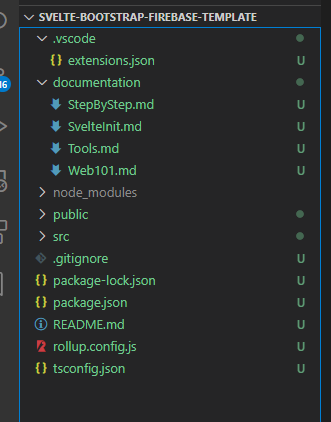

# Set up the project
## Create a Svelte project
[Here are the setup steps](./SvelteInit.md)

* [`package.json`](./01_InitialProjectFiles/package.json) This is the central configuration file for node and npm. It contains packages that are being used and run/build instructions. 
* [`package-lock.json`](./01_InitialProjectFiles/package-lock.json) Is a file maintained by npm that contains the concrete version of packages that are being used, do not change that file manually. 
* [`rollup.config.js`](./01_InitialProjectFiles/rollup.config.js) The configuration file for the Rollup compiler
* [`.gitignore`](./01_InitialProjectFiles/gitignore) Configuration file for git to define what files are excluded from version control
* `public` This folder contains the static files that client can load from the server.
  * [`index.html`](./01_InitialProjectFiles/public/index.html) The index file is the default file, that gets shown, when no specific page gets requested. This is the start point for your Single Page Application.
  * `favicon.ico` The default icon for the app.
* `src` The root folder for all source code files
  * `assets` Static resource files
  * [`main.js`](./01_InitialProjectFiles/src/main.ts) Main Typescript file that initializes the Svelte app.
  * [`App.Svelte`](./01_InitialProjectFiles/src/App.svelte) Defines the app component that is referred by `main.ts`. This is the starting point for all you Svelte code.

## Start up Visual Studio Code (or short VSCode)
Start Visual Studio Code. Once it's started click on File -> Open Folder and select the folder the project was created in.

## Start up the local server for the first time
Open a Terminal in VSCode and enter the following command `npm run dev`. The server will start on port 8080 on localhost, which is your computer. \
Open a browser and enter [`http://localhost:5000/`](http://localhost:5000/) in the address line and you will see the Hello World app.